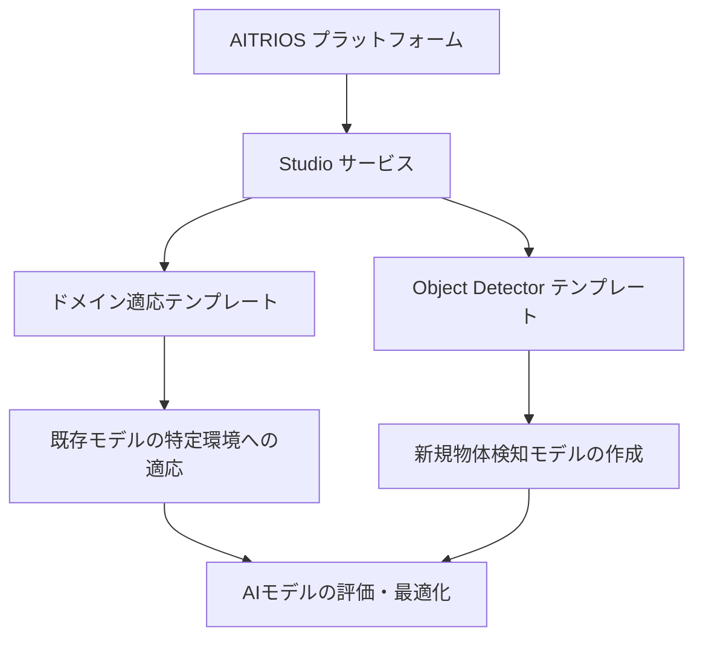
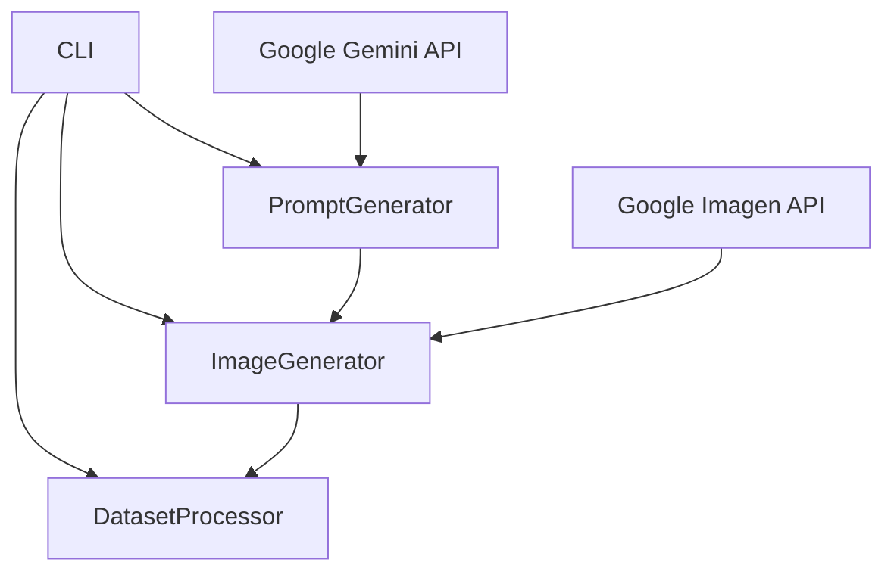
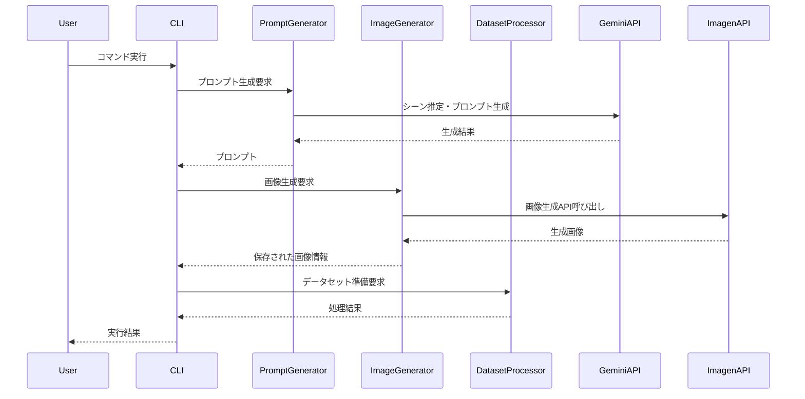

# AITRIOS Studioで空き缶検知AIを作ってみた！〜画像生成からモデル学習まで〜


## 目次

- [はじめに](#はじめに)
- [AITRIOSとStudioとは](#aitriosとstudioとは)
- [Studio Data Toolsの概要](#studio-data-toolsの概要)
- [ツールの内部構造](#ツールの内部構造)
- [使用例：空き缶検知AIの作成](#使用例空き缶検知aiの作成)
- [インストールと始め方](#インストールと始め方)
- [よくある質問](#よくある質問)

## はじめに

エッジAIの開発には、高品質なデータセットの準備が不可欠です。特に物体検知のような特定のユースケースでは、様々な環境や条件下での対象物の画像が必要となります。しかし、実際の現場で多様な条件下の画像を大量に収集するのは時間と労力がかかります。

**Studio Data Tools**は、このような課題を解決するために開発されたツールキットです。GoogleのGeminiとImagen AIを活用して、リアルな画像を生成し、ソニーのエッジAIセンシングプラットフォーム「AITRIOS™(アイトリオス)」のAIモデル最適化サービス「Studio」向けのデータセットを効率的に準備することができます。

このガイドでは、Studio Data Toolsの使い方から、実際に空き缶検知AIモデルを作成するまでの一連の流れを解説します。AITRIOSとStudioの概要から始め、ツールの内部構造、実践的な使用例、そしてインストール方法まで、初心者にもわかりやすく説明していきます。

## AITRIOSとStudioとは

### AITRIOS™(アイトリオス)とは

AITRIOS™(アイトリオス)は、ソニーセミコンダクタソリューションズ株式会社（SSS）が提供するエッジAIセンシングプラットフォームです。AIカメラなどのエッジデバイスを活用したセンシングソリューションの効率的な開発・導入を可能にします。

エッジAIとは、クラウドではなくデバイス自体（エッジ）で処理を行うAIのことで、以下のようなメリットがあります：

- **低遅延**: データをクラウドに送信する必要がないため、リアルタイム処理が可能
- **プライバシー保護**: 生データがデバイス内で処理されるため、プライバシーリスクが低減
- **ネットワーク負荷軽減**: 大量の画像データをクラウドに送信する必要がない
- **オフライン動作**: インターネット接続がなくても動作可能

### Studio（ストゥディオ）とは

Studio（ストゥディオ）は、AITRIOSプラットフォームの一部として提供される**AIモデル最適化サービス**です。2025年2月より日本でのサービス提供が開始された、**超Early Adopter向け**の先進的なサービスです。

Studioの主な特長は以下の通りです：

1. **AIモデル開発の工数大幅削減**：
   - 従来数日から数週間かかっていたAIモデルの再学習を最短1日以内で実行可能
   - 人手によるアノテーション（ラベリング）作業を自動化

2. **専門知識不要のAIモデル開発**：
   - 簡単な2ステップ（①画像の追加、②評価結果の確認）の繰り返しでAIモデルを開発可能
   - 専門用語の説明も提供されているため、AI開発の専門知識がなくても利用可能

3. **提供テンプレート**：
   - **ドメイン適応テンプレート**：既存のAIモデルを特定のドメイン（環境や条件）に適応させる
   - **Object Detector（任意物体検知）テンプレート**：最低50枚の画像から新規の任意物体検知AIモデルを作成



### Studioが解決する課題

エッジAIを活用したソリューション開発では、以下のような課題があります：

1. **リソース制限**：
   - カメラ（エッジデバイス）の演算力やメモリサイズなどの計算リソースに制限
   - AIモデルの小型化が必要

2. **環境適応の必要性**：
   - ユースケースや対象物、カメラの設置位置ごとに細かくAIモデルを最適化する必要がある

3. **開発の複雑さ**：
   - 画像へのアノテーション（ラベリング）作業
   - モデル出力結果の精度向上のためのパラメータ調整
   - 実際の要求通りに動作しているかの評価
   - AI開発の専門的知識の必要性

Studioはこれらの課題を解決し、エッジAI開発を大幅に効率化します。

## Studio Data Toolsの概要

Studio Data Toolsは、AITRIOSのStudioサービス向けのデータセット生成・処理ツールキットです。GoogleのGeminiとImagen AIを活用して、リアルな画像を生成し、Studioで使用するためのデータセットを効率的に準備することができます。

### 主な機能

1. **画像生成**：
   - GoogleのGeminiとImagen AIを使用して、リアルな画像を生成
   - 空き缶、ペットボトルなどの対象物の画像を様々な環境で生成可能

2. **シーン推定**：
   - LLM（大規模言語モデル）を使用して、リアルなシーン記述を動的に生成
   - 対象物が自然に存在する環境を自動的に推定

3. **高度なプロンプト生成**：
   - 写真のようなリアルな画像を生成するためのプロンプトを自動生成
   - アマチュアカメラマンが撮影したような自然な画像を生成

4. **データセット準備**：
   - 生成された画像をStudio用に処理・変換
   - データ拡張（augmentation）による多様なバリエーションの生成

5. **統一CLI**：
   - すべての機能を一つのコマンドラインインターフェースで提供
   - シンプルなコマンドで複雑な処理を実行可能

### コマンドラインインターフェース

Studio Data Toolsは、以下の主要なコマンドを提供しています：

1. **サンプル画像生成**（簡易版）：
   ```bash
   uv run python -m studio_data_tools samples --object "empty can" --count 2
   ```

2. **画像生成**（詳細オプション）：
   ```bash
   uv run python -m studio_data_tools generate --object "empty can" --count 10 --advanced-prompts
   ```

3. **データセット準備**：
   ```bash
   uv run python -m studio_data_tools prepare path/to/images --output-file Cam0.zip
   ```

4. **データ拡張**：
   ```bash
   uv run python -m studio_data_tools prepare test_run/empty_can --output-file Cam0_augmented.zip --augment --num-images 200
   ```

## ツールの内部構造

Studio Data Toolsは、以下の主要なコンポーネントで構成されています：



### 主要コンポーネント

1. **CLI（Command Line Interface）**：
   - ユーザーからのコマンドを受け取り、適切なコンポーネントに処理を委譲
   - 各種オプションの解析と処理の実行

2. **PromptGenerator**：
   - 画像生成のためのプロンプト（指示文）を生成
   - LLMを使用して、対象物に適したシーンを推定
   - 高度なプロンプト生成機能による写真のようなリアルな画像の生成

3. **ImageGenerator**：
   - GoogleのImagen APIを使用して画像を生成
   - 生成された画像の保存と管理
   - フォールバックメカニズムによる安定した画像生成

4. **DatasetProcessor**：
   - 生成された画像のStudio用フォーマットへの変換
   - データ拡張（augmentation）による多様なバリエーションの生成
   - ZIPファイル形式でのデータセット出力

### データフロー



## 使用例：空き缶検知AIの作成

ここでは、Studio Data Toolsを使用して空き缶検知AIモデルを作成する一連の流れを解説します。

### ステップ1：環境準備

まず、必要なツールとAPIキーを準備します：

1. Python 3.10以上をインストール
2. uvパッケージマネージャーをインストール
3. Google Gemini APIキーを取得（[Google AI Studio](https://makersuite.google.com/app/apikey)から）
4. リポジトリをクローンし、環境を設定

```bash
git clone <repo-url>
cd studio_data_tools
cp .env.example .env
# .envファイルを編集してGemini APIキーを設定
./setup_uv.sh
```

### ステップ2：サンプル画像の生成

まずは少数のサンプル画像を生成して、画像の品質を確認します：

```bash
uv run python -m studio_data_tools samples --object "empty can" --count 5
```

このコマンドは、高度なプロンプト生成を使用して5枚の空き缶画像を生成します。生成された画像は`sample_images/empty_can`ディレクトリに保存されます。

### ステップ3：本格的な画像生成

サンプル画像の品質に問題がなければ、より多くの画像を生成します：

```bash
uv run python -m studio_data_tools generate --object "empty can" --count 50 --advanced-prompts
```

このコマンドは、50枚の空き缶画像を生成します。生成された画像は`generated_images/empty_can`ディレクトリに保存されます。

生成オプションのカスタマイズ：
- `--min-objects`と`--max-objects`：画像内の対象物の数の範囲を指定
- `--num-objects`：画像内の対象物の正確な数を指定
- `--no-llm`：LLMによるシーン生成を無効化（より高速だが品質は低下）

### ステップ4：データセットの準備

生成された画像をStudio用のデータセットに変換します：

```bash
uv run python -m studio_data_tools prepare generated_images/empty_can --output-file Cam0.zip
```

このコマンドは、生成された画像をStudio用のフォーマットに変換し、`Cam0.zip`ファイルとして出力します。

### ステップ5：データ拡張（オプション）

より多様なデータセットを作成するために、データ拡張を適用します：

```bash
uv run python -m studio_data_tools prepare generated_images/empty_can --output-file Cam0_augmented.zip --augment --num-images 200
```

このコマンドは、元の画像から200枚の拡張画像を生成し、`Cam0_augmented.zip`ファイルとして出力します。

### ステップ6：Studioでのモデル学習

準備したデータセットをAITRIOSのStudioにアップロードし、AIモデルの学習を行います：

1. AITRIOSのStudioにログイン
2. Object Detectorテンプレートを選択
3. 準備したデータセット（`Cam0.zip`または`Cam0_augmented.zip`）をアップロード
4. 学習パラメータを設定し、モデル学習を開始
5. 評価結果を確認し、必要に応じてパラメータを調整
6. 最終的なモデルをエクスポート

## インストールと始め方

### 前提条件

- Python 3.10以上
- [uv](https://github.com/astral-sh/uv) - 高速Pythonパッケージマネージャー

### インストール手順

1. リポジトリをクローン：
   ```bash
   git clone <repo-url>
   cd studio_data_tools
   ```

2. 環境変数の設定：
   ```bash
   cp .env.example .env
   # .envファイルを編集してGemini APIキーを設定
   ```

3. uvを使用したインストール（自動的に仮想環境を作成）：
   ```bash
   ./setup_uv.sh
   # または以下のコマンドを手動で実行：
   # uv venv .venv
   # uv pip install -e .
   ```

### APIキーの取得

画像生成機能を使用するには、Google Gemini APIキーが必要です。以下の手順で取得できます：

1. [Google AI Studio](https://makersuite.google.com/app/apikey)にアクセス
2. Googleアカウントでログイン
3. APIキーを作成
4. 作成したAPIキーを`.env`ファイルに設定：
   ```
   GEMINI_API_KEY=your_api_key_here
   ```

## よくある質問

### Q: 画像生成に時間がかかりますか？
A: 1枚の画像生成には約10〜30秒かかります。高度なプロンプト生成を使用すると、さらに時間がかかる場合があります。

### Q: どのような対象物の画像を生成できますか？
A: 基本的には任意の物体の画像を生成できますが、特に「空き缶」「ペットボトル」「ガラス瓶」「紙コップ」などのゴミ関連の物体に最適化されています。

### Q: 生成された画像の著作権はどうなりますか？
A: GoogleのImagen APIで生成された画像の使用については、Googleの利用規約に従います。一般的に、生成された画像は研究や個人利用に適していますが、商用利用については制限がある場合があります。

### Q: データ拡張はどのような変換を行いますか？
A: 回転、クロップ、パディング、ぼかし、ノイズ追加、コントラスト調整、色調整などの変換を行います。これにより、様々な環境や条件下での対象物の認識精度を向上させることができます。

### Q: Studioで使用するデータセットの形式は？
A: Studioでは、特定のフォーマットのZIPファイルが必要です。Studio Data Toolsの`prepare`コマンドは、このフォーマットに自動的に変換します。基本的には`Cam0`ディレクトリ内に連番の画像ファイルが含まれている必要があります。

### Q: APIキーの使用量制限はありますか？
A: Google Gemini APIには使用量制限があります。無料枠もありますが、大量の画像を生成する場合は、使用量と料金に注意してください。

---

このガイドが、Studio Data Toolsの理解と活用に役立つことを願っています。AITRIOSのStudioサービスと組み合わせることで、効率的なエッジAI開発が可能になります。

詳細な情報や最新のアップデートについては、[AITRIOSの公式ウェブサイト](https://www.aitrios.sony-semicon.com/)をご確認ください。