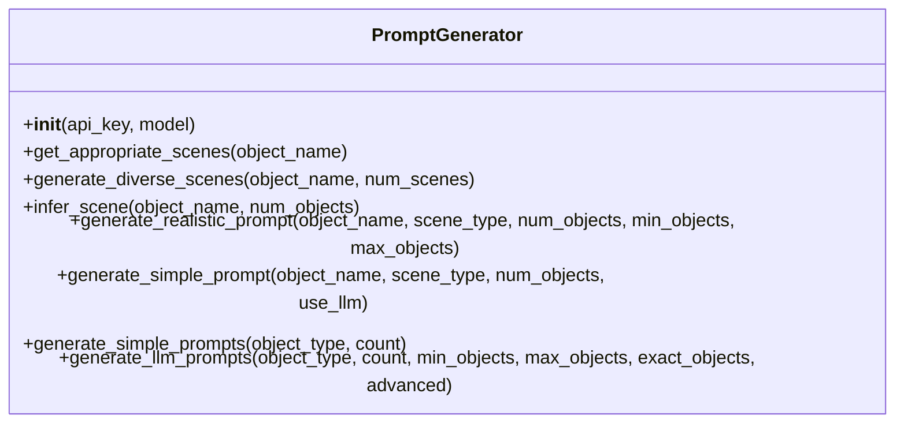
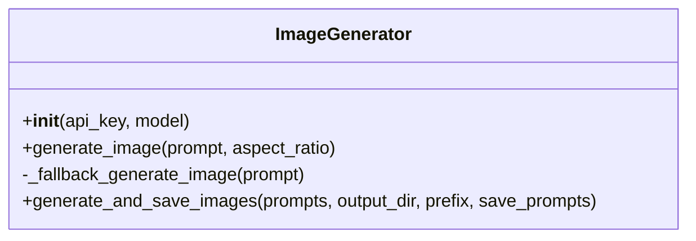
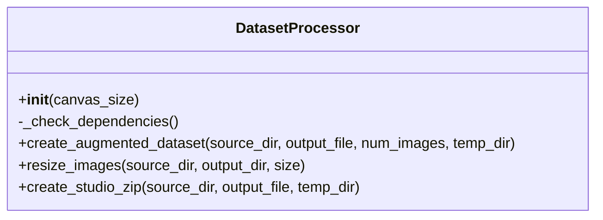
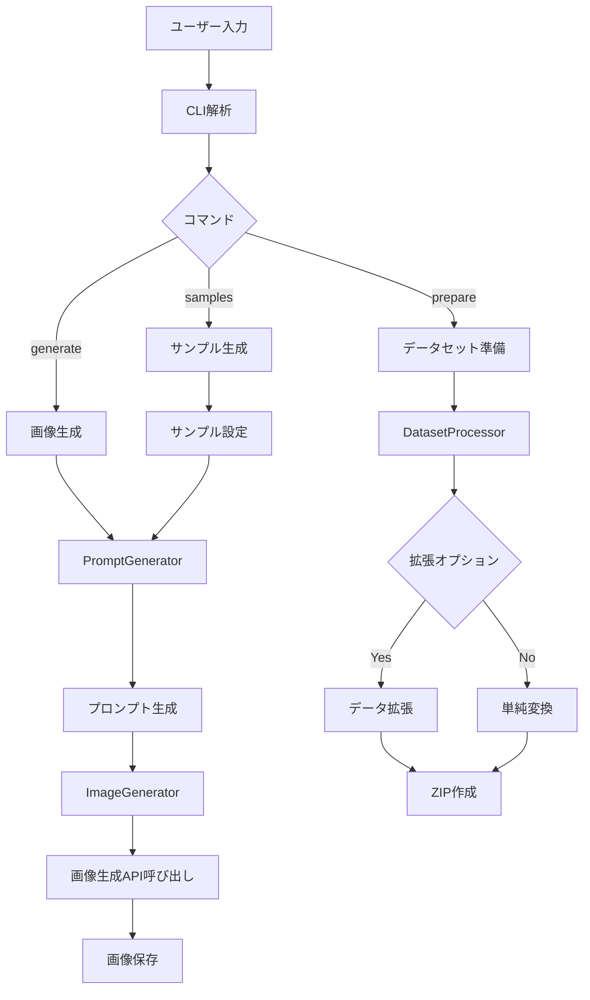

# Studio Data Tools 開発者ガイド

このドキュメントは、Studio Data Toolsの内部構造と拡張方法について説明します。開発者やコントリビューターを対象としています。

## プロジェクト構造

```
studio_data_tools/
├── __init__.py
├── __main__.py
├── cli.py                  # コマンドラインインターフェース
└── core/                   # コアモジュール
    ├── __init__.py
    ├── dataset_processor.py  # データセット処理
    ├── image_generator.py    # 画像生成
    └── prompt_generator.py   # プロンプト生成
```

## コアコンポーネント

### 1. PromptGenerator

`PromptGenerator`クラスは、画像生成のためのプロンプト（指示文）を生成します。



主な機能：
- 対象物に適したシーンの推定
- LLMを使用したリアルなシーン記述の生成
- 高度なプロンプト生成による写真のようなリアルな画像の生成
- シンプルなプロンプト生成（LLMを使用しない場合）

### 2. ImageGenerator

`ImageGenerator`クラスは、GoogleのImagen APIを使用して画像を生成します。



主な機能：
- Imagen APIを使用した画像生成
- フォールバックメカニズムによる安定した画像生成
- 生成された画像の保存と管理
- プロンプト情報のJSON形式での保存

### 3. DatasetProcessor

`DatasetProcessor`クラスは、生成された画像をStudio用に処理・変換します。



主な機能：
- 画像のリサイズと標準化
- データ拡張（augmentation）による多様なバリエーションの生成
- Studio用のZIPファイル形式でのデータセット出力

## データフロー



## 拡張方法

### 新しい対象物タイプの追加

`prompt_generator.py`の`OBJECT_SCENE_MAP`辞書に新しい対象物とそれに適したシーンを追加します：

```python
OBJECT_SCENE_MAP = {
    # 既存のマッピング
    "empty can": [...],
    "plastic bottle": [...],
    
    # 新しい対象物を追加
    "new_object": [
        "scene description 1",
        "scene description 2",
        # ...
    ]
}
```

### 新しいデータ拡張手法の追加

`dataset_processor.py`の`create_augmented_dataset`メソッド内の拡張パイプラインを修正します：

```python
# 拡張パイプラインの定義
seq = iaa.Sequential([
    # 既存の拡張
    iaa.Affine(rotate=(-15, 15)),
    iaa.GaussianBlur((0.0, 3.0)),
    
    # 新しい拡張を追加
    iaa.NewAugmentation(params),
    
    # ...
], random_order=True)
```

### 新しい画像生成モデルの追加

`image_generator.py`の`generate_image`メソッドを拡張して、新しいモデルをサポートします：

```python
def generate_image(self, prompt: str, aspect_ratio: str = "1:1") -> Optional[Image.Image]:
    # 既存のモデル処理
    if self.model_name == 'imagen-3.0-generate-002':
        # 既存の処理
    
    # 新しいモデルの処理を追加
    elif self.model_name == 'new-model-name':
        # 新しいモデル用の処理
        
    # フォールバック
    else:
        return self._fallback_generate_image(prompt)
```

## 開発環境のセットアップ

開発用の環境をセットアップするには：

```bash
# 開発依存関係を含めてインストール
uv pip install -e ".[dev]"

# テストの実行
uv run pytest
```

## コントリビューションガイドライン

1. **コーディング規約**: PEP 8に従ってください
2. **ドキュメント**: 新しい機能には適切なドキュメントを追加してください
3. **テスト**: 新しい機能や修正にはテストを追加してください
4. **コミットメッセージ**: 明確で説明的なコミットメッセージを使用してください
5. **プルリクエスト**: 変更内容を説明する詳細なプルリクエスト説明を提供してください

## 依存関係

主な依存関係：
- `google-genai`: GoogleのGenerative AI Python SDK
- `Pillow`: 画像処理
- `numpy`: 数値計算（imgaugとの互換性のためにバージョン1.26.4に固定）
- `imgaug`: 画像拡張
- `python-dotenv`: 環境変数管理

開発用依存関係：
- `pytest`: テスト
- `black`: コード整形
- `isort`: インポート整理
- `flake8`: リンター

## トラブルシューティング

### APIの問題

Google Gemini APIに関する問題が発生した場合：
- APIキーが有効であることを確認
- API使用量の制限に達していないか確認
- ネットワーク接続を確認

### 画像生成の問題

画像生成に問題がある場合：
- プロンプトの品質を確認（過度に複雑なプロンプトは失敗する可能性があります）
- フォールバックメカニズムが機能しているか確認
- 異なるモデルを試す（`--model`オプションで指定）

### データ拡張の問題

データ拡張に問題がある場合：
- `imgaug`が正しくインストールされているか確認
- メモリ使用量を確認（大量の画像を処理する場合はメモリ不足になる可能性があります）
- バッチサイズを小さくして試す（`create_augmented_dataset`メソッド内の`batch_size`変数）

## 将来の拡張計画

1. **追加のモデルサポート**: 他の画像生成モデルのサポート
2. **アノテーション機能**: 生成された画像の自動アノテーション
3. **GUIインターフェース**: コマンドラインに加えてGUIインターフェースの提供
4. **クラウド統合**: クラウドストレージとの統合
5. **バッチ処理の最適化**: 大規模データセットの効率的な処理

## 参考リソース

- [Google Gemini API ドキュメント](https://ai.google.dev/docs)
- [imgaug ドキュメント](https://imgaug.readthedocs.io/)
- [AITRIOS 公式ウェブサイト](https://www.aitrios.sony-semicon.com/)