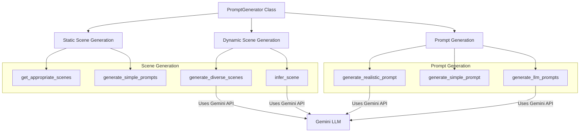
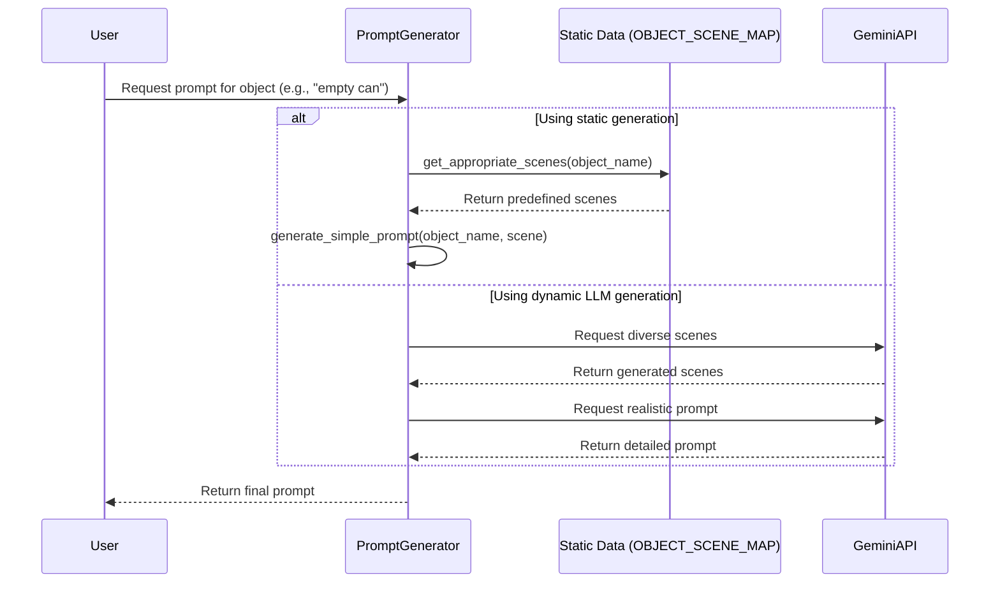
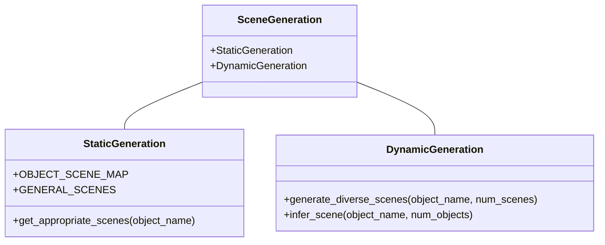
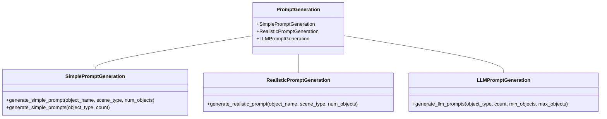
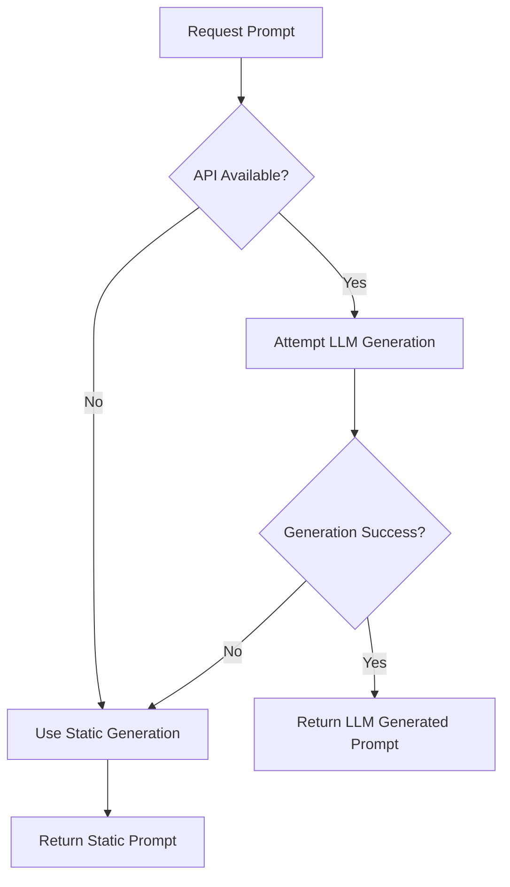

# Dynamic Scene and Prompt Generation Architecture

This document describes the architecture and flow of the dynamic scene and prompt generation process in the `PromptGenerator` module.

## Overview

The `PromptGenerator` module enables the creation of diverse and realistic prompts for image generation, with a focus on generating varied scenes containing specific objects like trash items (empty cans, plastic bottles, etc). It uses Google's Gemini API to dynamically generate scene descriptions and detailed prompts.

## Architecture Diagram



## Process Flow



## Component Details

### 1. Scene Generation

Two main approaches are used for scene generation:



#### Static Scene Generation
- Relies on predefined mappings in `OBJECT_SCENE_MAP`
- Provides reliable fallback when API is unavailable
- Limited variety but consistent results

#### Dynamic Scene Generation
- Uses Gemini API to generate creative and diverse scene descriptions
- Provides more variety and context-awareness
- Requires API access and includes error handling with fallback to static generation

### 2. Prompt Generation

Three main methods for prompt generation:



#### Simple Prompt Generation
- Uses templates with basic descriptions
- Fast and doesn't require API calls
- Less varied but consistent

#### Realistic Prompt Generation
- Uses Gemini API to create detailed, realistic prompts
- Includes technical photography aspects and scene descriptions
- More varied and contextual, but requires API access

#### LLM Prompt Generation
- Most advanced approach using sophisticated prompting techniques
- Supports advanced mode for more creative descriptions
- Highly varied and adaptable, but fully dependent on API access

## Configuration Parameters

The prompt generation process can be customized with various parameters:

| Parameter | Description | Default | Used In |
|-----------|-------------|---------|---------|
| `object_name` | Target object for the scene | Required | All methods |
| `scene_type` | Scene description | Auto-inferred if not provided | All prompt generators |
| `num_objects` | Number of objects in the scene | Random (1-3) | All prompt generators |
| `min_objects` | Minimum number of objects | 1 | `generate_realistic_prompt`, `generate_llm_prompts` |
| `max_objects` | Maximum number of objects | 3 or 5 | `generate_realistic_prompt`, `generate_llm_prompts` |
| `count` | Number of prompts to generate | 1 | `generate_simple_prompts`, `generate_llm_prompts` |
| `advanced` | Use advanced prompt techniques | False | `generate_llm_prompts` |
| `use_llm` | Whether to use LLM for scene inference | True | `generate_simple_prompt` |
| `exact_objects` | Exact number of objects | None | `generate_llm_prompts` |

## Fallback Mechanisms

The system includes robust fallback mechanisms to handle API failures:



## Examples

### Example 1: Simple Static Prompt

Input:
```python
generator = PromptGenerator(api_key="YOUR_API_KEY")
prompt, scene, count = generator.generate_simple_prompt("empty can", use_llm=False)
```

Output:
```
Prompt: "An amateurish smartphone photo of 2 empty can(s) in a urban street with empty cans on asphalt..."
Scene: "urban street with empty cans on asphalt"
Count: 2
```

### Example 2: Dynamic LLM Prompt

Input:
```python
generator = PromptGenerator(api_key="YOUR_API_KEY")
prompt_data = generator.generate_realistic_prompt("plastic bottle", "riverbank with discarded items")
```

Output:
```
{
  "prompt": "An unsteady smartphone photo of plastic bottles scattered along a muddy riverbank...",
  "scene": "riverbank with discarded items",
  "object_count": 3,
  "object": "plastic bottle"
}
``` 