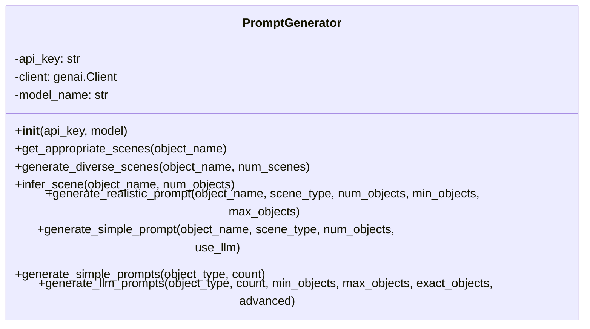
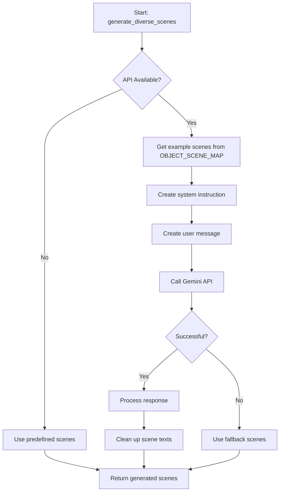
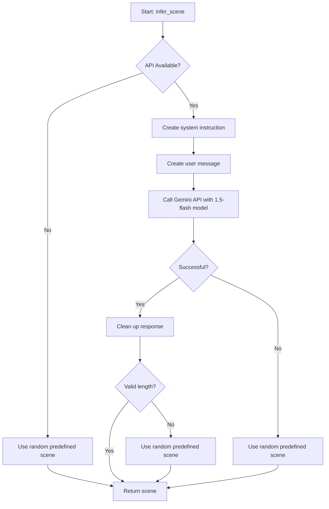
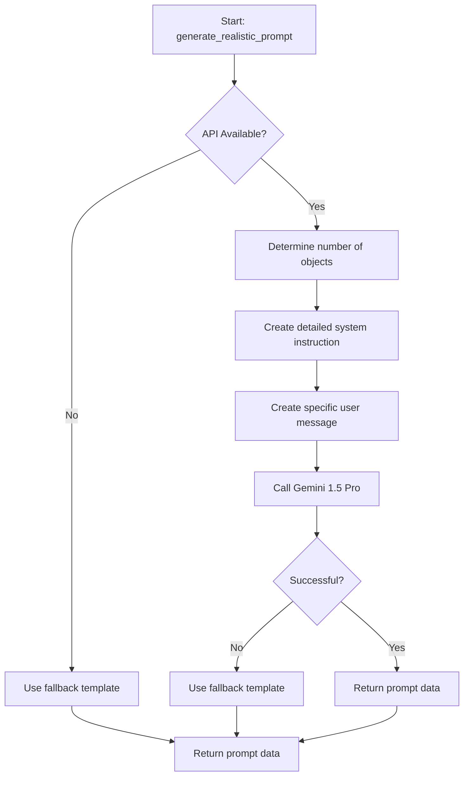
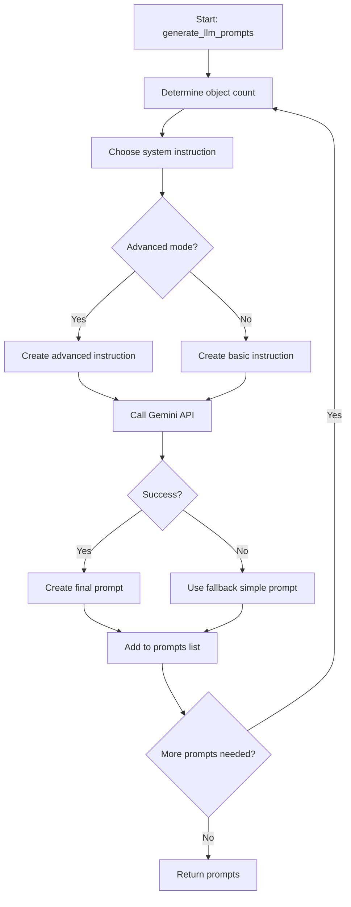
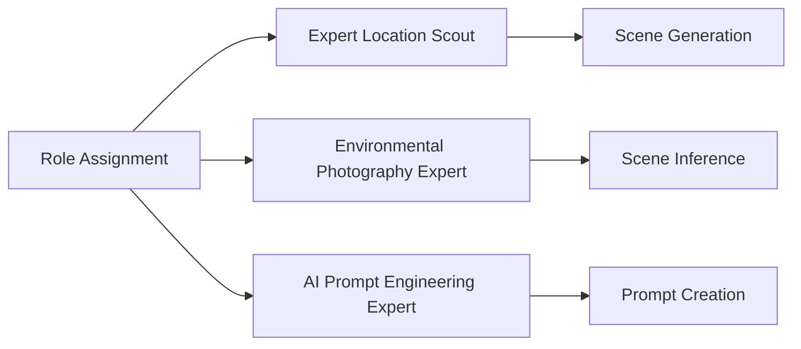
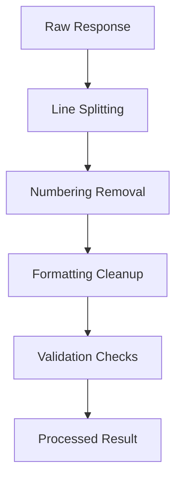
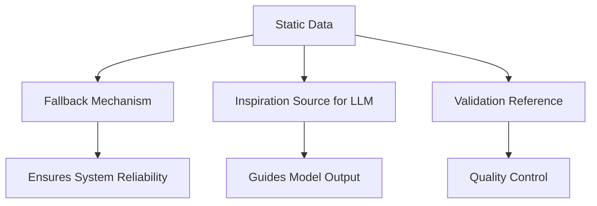

# Prompt Generator Implementation Details

This document provides technical details about the implementation of the prompt generation system, focusing on the scene generation and prompt creation processes.

## Code Structure



## Dynamic Scene Generation

### Scene Diversity with `generate_diverse_scenes`

The `generate_diverse_scenes` method is a key component for creating varied scene descriptions:



Implementation details:
1. Uses Gemini 1.5 Pro model for higher creativity
2. Creates a system instruction that positions the AI as a "location scout"
3. Provides examples from the predefined scene map to guide generation
4. Sets temperature to 0.8 for creative variety
5. Processes response by:
   - Splitting into lines
   - Removing numbering and formatting
   - Cleaning up the text
6. Includes robust error handling with fallback to predefined scenes

### Context-Aware Scene Inference with `infer_scene`

The `infer_scene` method dynamically creates appropriate scenes for a specific object:



Implementation details:
1. Uses faster Gemini 1.5 Flash model for quicker inference
2. System instruction positions AI as expert in environmental photography
3. User message requests brief 5-10 word descriptions
4. Sets temperature to 0.7 (slightly lower than for diverse generation)
5. Validates response quality (length check)
6. Falls back to predefined scenes if generation fails

## Prompt Generation Techniques

### 1. Realistic Prompt Generation

The `generate_realistic_prompt` method creates detailed, technically-rich prompts:



Key implementation features:
1. Uses extensive system instructions (700+ tokens) that guide the model to:
   - Create amateur photography descriptions
   - Include technical flaws like bad white balance, noise
   - Create off-center compositions
   - Include lighting problems and camera shake
2. Uses structured prompting approach with specific requirements
3. Returns complete data object with prompt, scene, object count, and object

### 2. LLM Prompt Generation

The `generate_llm_prompts` method offers the most flexible approach:



Advanced features:
1. Support for exact object counts or random ranges
2. Two instruction modes:
   - Basic mode: Simple scene descriptions
   - Advanced mode: Detailed photographer-style descriptions
3. Processing loop to generate multiple prompts at once
4. Fallback to simple prompts on API failure

## Prompt Engineering Techniques

The module employs several advanced prompt engineering techniques:

### 1. Role-Based Prompting

Each method assigns a specific expertise role to the LLM:
- "Expert location scout" for diverse scenes
- "Expert in environmental photography" for scene inference
- "Expert in generating prompts for AI image generators" for realistic prompts



### 2. Detailed Parameter Control

Temperature settings are carefully tuned for each use case:
- 0.8 for creative diversity in scene generation
- 0.7 for more controlled scene inference
- 0.8 for realistic prompt generation with balanced creativity

### 3. Multi-Step Processing



### 4. Contextual Examples

For `generate_diverse_scenes`, examples from the same object category are included in the prompt to guide the model toward appropriate scene types.

## Integration with Static Data

Static predefined data (`OBJECT_SCENE_MAP` and `GENERAL_SCENES`) serves multiple purposes:

1. **Fallback mechanism** when API is unavailable or fails
2. **Inspiration source** for the LLM (examples provided in prompts)
3. **Validation reference** to ensure outputs are appropriate



## Error Handling and Robustness

All LLM-based methods include comprehensive error handling:

1. API availability checks
2. Try-except blocks around API calls
3. Response validation (length checks, content checks)
4. Fallback to static generation methods
5. Warning messages for tracking issues

## Performance Considerations

The module balances quality and performance:

1. Uses different Gemini models based on needs:
   - Gemini 1.5 Pro for detailed prompt generation
   - Gemini 1.5 Flash for quicker scene inference
   - Default model (`gemini-2.0-flash-001`) configurable at initialization
2. Caches environment variables (API keys)
3. Reuses existing client connection
4. Optional parameters to control generation complexity

## Usage Examples

### Example 1: Generating Diverse Scenes

```python
from studio_data_tools.core.prompt_generator import PromptGenerator

# Initialize with API key
generator = PromptGenerator(api_key="YOUR_API_KEY")

# Generate 5 diverse scenes for empty cans
scenes = generator.generate_diverse_scenes("empty can", num_scenes=5)
print(scenes)
```

Output:
```
[
  "Urban alleyway with empty cans beside graffiti wall",
  "Park bench with discarded cans under afternoon shadows",
  "Convenience store parking lot with scattered cans",
  "Riverside rocks with empty cans caught in driftwood",
  "Festival grounds morning after with empty cans on trampled grass"
]
```

### Example 2: Creating Multiple Advanced Prompts

```python
from studio_data_tools.core.prompt_generator import PromptGenerator

# Initialize generator
generator = PromptGenerator()

# Generate 3 advanced prompts for plastic bottles with 2-4 objects
prompts = generator.generate_llm_prompts(
    object_type="plastic bottle",
    count=3,
    min_objects=2,
    max_objects=4,
    advanced=True
)

for prompt in prompts:
    print(f"Scene: {prompt['scene']}")
    print(f"Count: {prompt['object_count']}")
    print(f"Prompt: {prompt['prompt'][:100]}...\n")
```

## Implementation Considerations

When modifying or extending the prompt generator:

1. **API Changes**: If Google's Genai API changes, update the client initialization and model calls
2. **New Object Types**: Add new object types to `OBJECT_SCENE_MAP` with appropriate scenes
3. **Performance Tuning**: Adjust model selection and temperature parameters based on needs
4. **Error Handling**: Maintain the fallback mechanisms to ensure robustness 