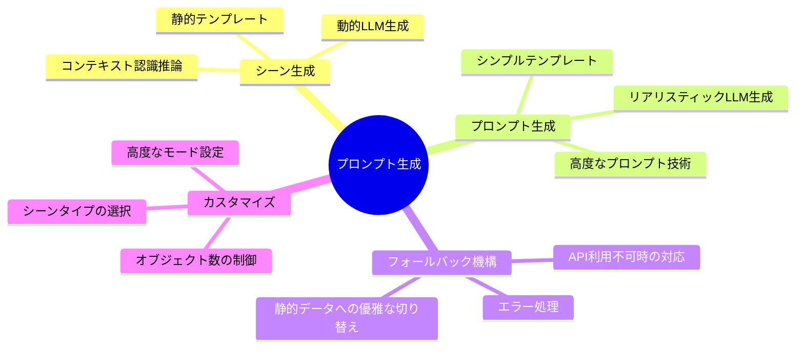
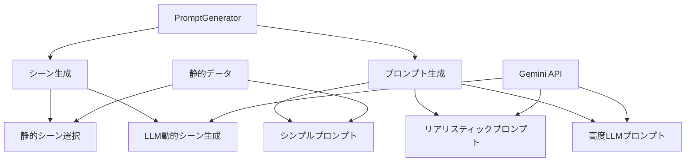

# プロンプト生成システム ドキュメント

このセクションでは、`studio_data_tools.core.prompt_generator`モジュールの機能と使用方法について詳細に説明します。このモジュールは、画像生成用の多様でリアルなプロンプトを動的に生成するための機能を提供します。

## 概要

プロンプト生成システムは、ゴミ検出用のトレーニングデータセットや環境内の特定オブジェクトのシーン変異のための画像生成に役立ちます。静的なテンプレートから高度なLLM生成まで、様々なレベルの複雑さに対応しています。

## ドキュメント構成

プロンプト生成システムのドキュメントは以下のセクションで構成されています：

1. **[アーキテクチャ概要](./prompt_generator_architecture.md)**
   - システム全体の構造と処理フローの図解
   - コンポーネント間の関係性
   - 主要な機能の概要

2. **[実装詳細](./prompt_generator_implementation.md)**
   - コードの技術的実装の解説
   - 動的シーン生成のアルゴリズム
   - プロンプト生成テクニック
   - プロンプトエンジニアリング手法
   - エラー処理とフォールバックメカニズム

3. **[使用ガイド](./prompt_generator_usage_guide.md)**
   - 基本的な使い方
   - 応用例
   - 実用的なユースケース
   - トラブルシューティング

## 主要な特徴



## クイックスタート

```python
from studio_data_tools.core.prompt_generator import PromptGenerator

# 初期化
generator = PromptGenerator()

# シンプルなプロンプト生成
prompt, scene, count = generator.generate_simple_prompt("empty can")
print(f"生成されたプロンプト: {prompt[:100]}...")

# 詳細なプロンプト生成
result = generator.generate_realistic_prompt(
    object_name="plastic bottle",
    scene_type="urban sidewalk",
    num_objects=3
)
print(f"シーン: {result['scene']}")
print(f"オブジェクト数: {result['object_count']}")
print(f"プロンプト: {result['prompt'][:100]}...")
```

## コンポーネント関連図



## ユースケースの例

- **トレーニングデータセット生成**: ゴミ検出アルゴリズム用の多様な環境シーンプロンプト
- **環境監視シミュレーション**: 様々な条件下での特定オブジェクトの見え方
- **コンピュータビジョンテスト**: 異なる条件下でのオブジェクト検出のテスト

## 関連リソース

- [プロンプトジェネレーターアーキテクチャ](./prompt_generator_architecture.md)
- [実装詳細](./prompt_generator_implementation.md)
- [使用ガイド](./prompt_generator_usage_guide.md)

## コードリファレンス

メインクラスと重要なメソッド：

- `PromptGenerator`: プロンプト生成システムのメインクラス
  - `get_appropriate_scenes()`: オブジェクト名に適したシーンを取得
  - `generate_diverse_scenes()`: LLMを使った多様なシーン生成
  - `infer_scene()`: オブジェクトに適したシーンを推論
  - `generate_realistic_prompt()`: 詳細なリアリスティックプロンプト生成
  - `generate_simple_prompt()`: シンプルなプロンプト生成
  - `generate_simple_prompts()`: 複数のシンプルプロンプト生成
  - `generate_llm_prompts()`: LLMを使った高度なプロンプト生成 